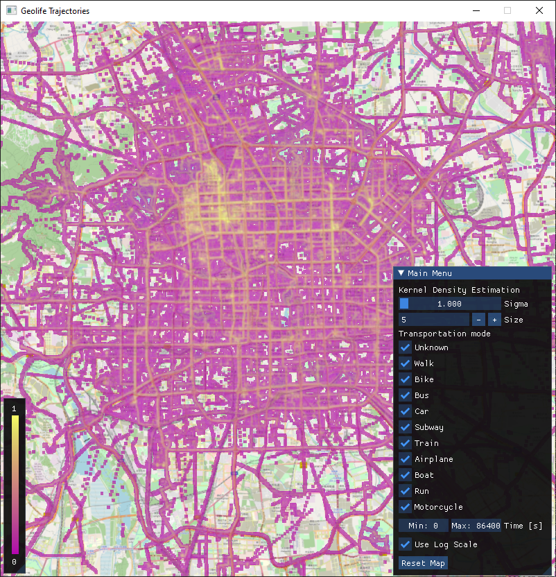
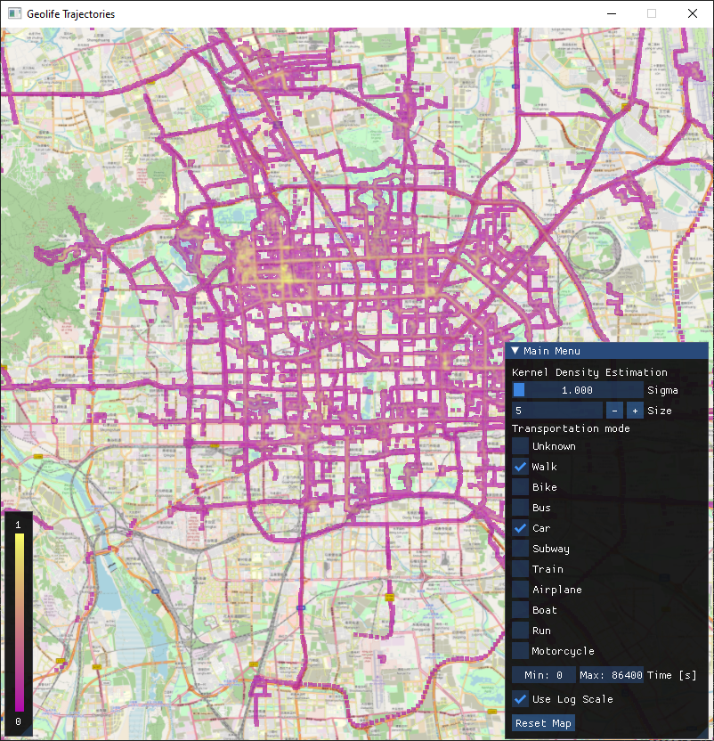
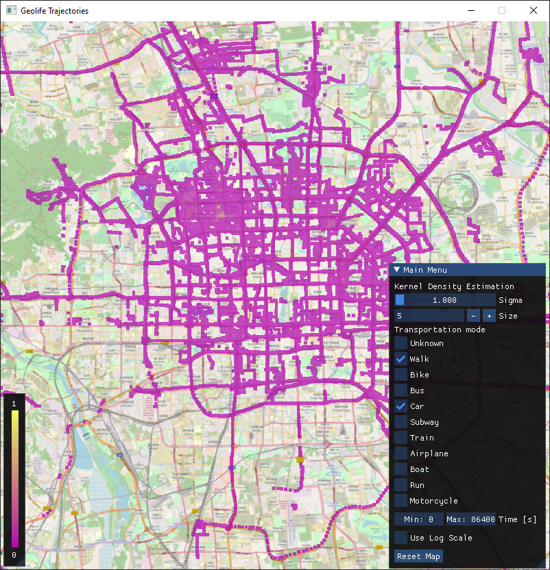
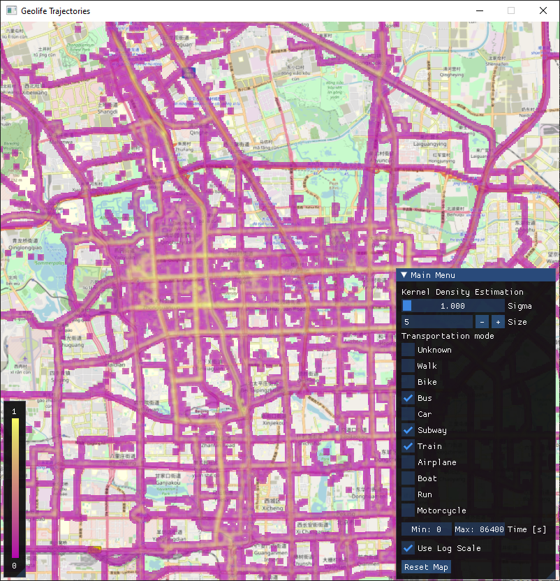
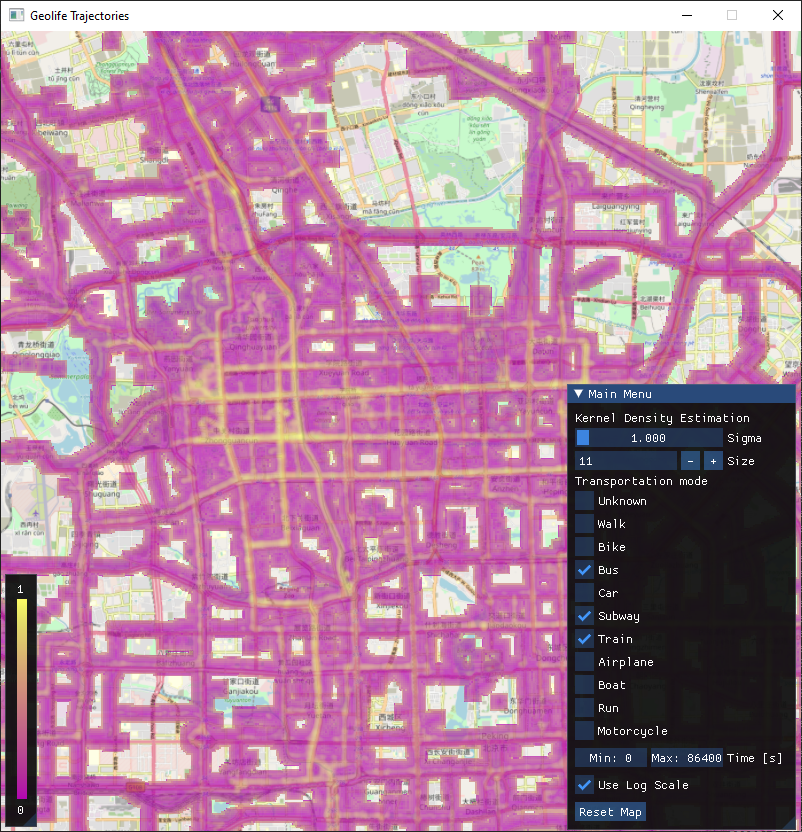
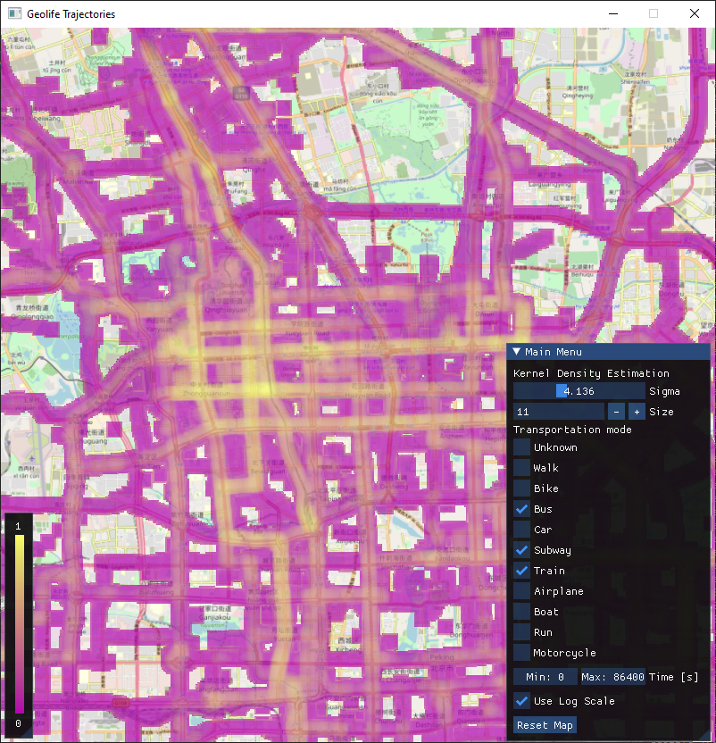

# Geolife Trajectories

## Introduction

This project targets a real-time visualisation of the dataset provided by Microsoft Asia
[(Source)](https://www.microsoft.com/en-us/download/details.aspx?id=52367). It consists of trajectory data from 182 users amounting to a total of 1 292 951 km in 50 176 hours. Most of the data were recorded in Beijing, China. 

The dataset includes a total of 24 876 978 points. However, in this project, only the region around Beijing is considered. Therefore the points have been preprocessed and are only from 116.15 to 116.6 longitude and from 39.75 to 40.10 latitude. This filtering dropped the total points in the dataset to 18 238 686.

Seventy-three users labelled their trajectory data using ten different transportation modes: walk, bike, bus, car, subway, train, aeroplane, boat, run and motorcycle. However, most data remained unlabeled and were assigned the mode unknown.

----
## Visualization

This project uses the Kernel Density Estimation approach to compute a popularity heatmap. The kernel is a standard square discrete Gaussian kernel with the size and sigma parameter according to the values input in the GUI. First, for each point, a Gaussian kernel is accumulated in the buffer. Afterwards, a maximal value in the heatmap buffer is extracted using parallel GPU aggregation. This found value is then used to normalise the data. As seen in Figure 2, the data points in the dataset are unevenly distributed and accumulated in one area. This results in a visualisation that only shows different shades in one location. To eliminate this problem, an option to use a logarithmic scale was added (Figure 1).

----

## Implementation

This project was implemented using C++. Rendering was done using OpenGL 4.6 with a GUI library [ImGui](https://github.com/ocornut/imgui) . Background processing is implemented using CUDA 11. As this implementation relies on atomic operations, the minimal required compute capability is 6.0.

----

## User Guide

#### Map movement

Zooming and movement of a map are implemented using a `scroll wheel` and `keyboard arrows`. The map position can be reset using the button `reset map`.

#### Kernel Density Estimation parameters

Two main parameters for the KDE algorithm are the size of the kernel and sigma. Both can be regulated in the top two rows. `Size` must be a positive even number; `sigma` is a real number from 1.0 to 10.0.

#### Data Filtering

In the section Transportation mode, the user can filter what type of transportation he wants to observe on the map. A checked box means that the transportation mode will be drawn. Under the checkmarks for the transportation mode, the user can use two sliders to filter the time interval in which the points should be.

----

## Demo

##### All values in the dataset

##### Log scaling option

**With log scaling**             |  **Without log scaling**
:-------------------------:|:-------------------------:
  |  

##### Kernel Density Estimation options

**Standard size**             |  **Large size** | **Large size with large sigma**
:-------------------------:|:-------------------------:|:-------------------------:
  |   | 

